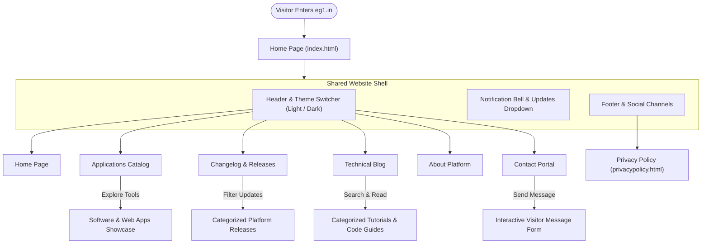

# EG1 - Official Website & Digital Platform

[](https://www.eg1.in)
[](data/updates.json)
[](LICENSE)

**EG1** ([eg1.in](https://www.eg1.in)) is a personal hobby platform for open source and creative digital projects, presenting practical engineering software/tools, interactive web applications for real-world use and technical articles/blog posts.

---

## 🚀 Latest Highlights

| Feature | Description |
| :--- | :--- |
| **📝 Pure Markdown Blog Engine** | Direct client-side Markdown (.md) rendering with zero Firestore reads, YAML frontmatter parser, and 1-click code copying. |
| **🛠️ Admin TableToolkit Engine** | Standalone modular table engine with natural alphanumeric (`Intl.Collator`), datetime, numeric sorting, and universal pagination. |
| **👥 App Users Workspace** | Interactive management grid with multi-app filtering, status toggling, search, and 16-field visitor telemetry inspection. |
| **🎛️ Dynamic Dual Action Buttons** | Configurable `button1` and `button2` actions supporting custom labels, URLs, tab targets (`sameTab`), and custom icons. |
| **🏷️ Automated 3-Tier Versioning** | Dynamic version resolution with live GitHub API release integration, persistent caching, and static fallbacks. |
| **🎨 Dual Theme System** | High-contrast Light Gray and Dark Gray themes with instant zero-flicker loading across website and Admin Panel. |
| **🔔 Changelog & Notification Center** | Real-time updates dropdown with unread badge tracking, animated alerts, and category filtering. |

---

## 🗺️ Website Navigation & Visitor Flow



---

## 🎨 Website Pages UI Wireframes

### 1. Home Page (`index.html`)
```text
+-------------------------------------------------------------------------+
| [EG1 Logo]        [Home] [Apps] [Explore v] [About] [Contact] (Bell)[🌓]|
+-------------------------------------------------------------------------+
| [=================== Image Slider Header Banner =====================]  |
| "WELCOME TO EG1 - Solutions, Coding, Innovations & Creative Tools"      |
+-------------------------------------------------------------------------+
| ANNOUNCEMENTS / NEWS CONTAINER (#newsContainer)                         |
| "A platform for solutions, coding, programming, innovations..."        |
+-------------------------------------------------------------------------+
| FEATURED APPLICATIONS (Slick Carousel Slider .regular)                  |
| +-------------------+  +-------------------+  +-------------------+     |
| | [App Icon]        |  | [App Icon]        |  | [App Icon]        |     |
| | Product Title     |  | Product Title     |  | Product Title     |     |
| | Version 3.1.0     |  | Version 3.1.0     |  | Version 3.1.0     |     |
| | Short Description |  | Short Description |  | Short Description |     |
| | [View] [Download] |  | [View] [Download] |  | [View] [Download] |     |
| +-------------------+  +-------------------+  +-------------------+     |
+-------------------------------------------------------------------------+
| FOOTER (Logo Badge, About Snippet, Social Links, Contact CTA, Copyright)|
+-------------------------------------------------------------------------+
```

### 2. Applications Showcase (`apps.html`)
```text
+-------------------------------------------------------------------------+
| HEADER & NAVIGATION                                                     |
+-------------------------------------------------------------------------+
| Page Banner: "APPLICATIONS"                                             |
+-------------------------------------------------------------------------+
| MODE 1: FULL CATALOGUE MODE (no URL parameters)                         |
| +---------------------------------------------------------------------+ |
| | [App Icon]  Application Title                                       | |
| |             Version 3.1.0 | Desktop App / Utility                   | |
| |             Short description, platform, features.                  | |
| |             [ VIEW DETAILS ]   [ DOWNLOAD ]                         | |
| +---------------------------------------------------------------------+ |
|                                                                         |
| MODE 2: SINGLE PRODUCT DETAIL MODE (?id=...)                            |
| +------------------------------------+--------------------------------+ |
| | MAIN PRODUCT DETAILS               | OTHER APPLICATIONS             | |
| | [App Icon] Title (v3.1.0)          | - Application #2               | |
| | Full markdown/HTML description     | - Application #3               | |
| | System Requirements                | - Application #4               | |
| | [ DOWNLOAD NOW ] [ VIEW GITHUB ]   |                                | |
| +------------------------------------+--------------------------------+ |
+-------------------------------------------------------------------------+
| FOOTER                                                                  |
+-------------------------------------------------------------------------+
```

### 3. Changelog & Releases (`updates.html`)
```text
+-------------------------------------------------------------------------+
| HEADER & NAVIGATION                                                     |
+-------------------------------------------------------------------------+
| Page Banner: "UPDATES & RELEASES - Release changelogs & software updates"|
+-------------------------------------------------------------------------+
| FILTER TABS:  [ All (3) ]  [ Website (2) ]  [ Apps (1) ]                |
+-------------------------------------------------------------------------+
| TIMELINE CARDS CONTAINER (#updatesPageListContainer)                   |
|                                                                         |
| +---------------------------------------------------------------------+ |
| | [Spark Icon]  EG1 Website v3.1.0               [Aug 30, 2026] [v3.1]| |
| | Static Data Engine, Dynamic Buttons & Fluid Typography...           | |
| | [View Details ->]                                                   | |
| +---------------------------------------------------------------------+ |
|                                                                         |
| +---------------------------------------------------------------------+ |
| | [Globe Icon]  EG1 Website v3.0.0               [Aug 29, 2026] [v3.0]| |
| | Light & Dark Theme and Updates System...                            | |
| | [View Details ->]                                                   | |
| +---------------------------------------------------------------------+ |
+-------------------------------------------------------------------------+
| FOOTER                                                                  |
+-------------------------------------------------------------------------+
```

### 4. Technical Blog Engine (`blog.html`)
```text
+-------------------------------------------------------------------------+
| HEADER & NAVIGATION                                                     |
+-------------------------------------------------------------------------+
| Page Banner: "BLOG"                                                     |
+------------------------------------------+------------------------------+
| MAIN CONTENT AREA (col-md-8)             | SIDEBAR (col-md-4)           |
|                                          | [ Search blog...    ] [Go]   |
| [Detail / Latest Mode]                   |                              |
| - Hero Banner Image                      | CATEGORIES                   |
| - Title & Metadata (Category, Date)      | - Programming                |
| - Fluid Body Text & Formatted Paragraphs | - Security & Logic           |
| - Copyable Code Blocks (Highlight.js)    | - Web Utilities              |
|                                          |                              |
| [Grid Mode: ?cat= or ?search=]           | PREVIOUS TOPICS              |
| - 3-Column Card Grid (18 items/page)     | - Topic Post Link #1         |
| - Pagination: [Prev] 1 2 3 [Next]        | - Topic Post Link #2         |
+------------------------------------------+------------------------------+
| FOOTER                                                                  |
+-------------------------------------------------------------------------+
```

### 5. About Platform (`about.html`)
```text
+-------------------------------------------------------------------------+
| HEADER & NAVIGATION                                                     |
+-------------------------------------------------------------------------+
| Header Banner: "ABOUT EG1"                                              |
+-------------------------------------------------------------------------+
| ABOUT CONTENT BOX (#aboutTitleText & #aboutContentText)                 |
| - Overview of the EG1 open-source platform                              |
| - Platform vision, mission, and technical research                      |
| - Developer profile, tools highlights, and community links              |
| - Fallback static HTML copy displayed if offline                        |
+-------------------------------------------------------------------------+
| FOOTER                                                                  |
+-------------------------------------------------------------------------+
```

### 6. Contact Portal (`contact.html`)
```text
+-------------------------------------------------------------------------+
| HEADER & NAVIGATION                                                     |
+-------------------------------------------------------------------------+
| Header Banner: "CONTACT US"                                             |
+------------------------------------------+------------------------------+
| INQUIRY FORM (col-md-6)                  | DIRECT CHANNELS (col-md-6)   |
| "Any message?"                           | Email: eg1dotin@gmail.com    |
| [ Your Name                          ]   |                              |
| [ Email Address                      ]   | Social Platforms:            |
| [ Phone Number                       ]   | - GitHub: @EG1DOTIN          |
| [ Anti-Spam Check: 5 + 3 = [    ]    ]   | - Facebook: @eg1dotin        |
| [ Message Textarea                   ]   | - Instagram: @eg1dotin       |
| [ Send Enquiry ⮠                      ]   | - X / Twitter: @eg1dotin     |
+------------------------------------------+------------------------------+
| FOOTER                                                                  |
+-------------------------------------------------------------------------+
```

### 7. Privacy Policy (`privacypolicy.html`)
```text
+-------------------------------------------------------------------------+
| HEADER & NAVIGATION                                                     |
+-------------------------------------------------------------------------+
| Header Banner: "PRIVACY POLICY"                                         |
| Last updated: 2026                                                      |
| <hr />                                                                  |
| 1. Information Collection and Use (IP, Device, City Telemetry)          |
| 2. No Sale of Data Guarantee                                            |
| 3. Analytics Preferences & Consent Control                              |
|    [ ⚙️ Open Analytics Preferences Banner ]                             |
+-------------------------------------------------------------------------+
| FOOTER                                                                  |
+-------------------------------------------------------------------------+
```

---

## 📄 Website Pages Directory

| Page | File | Description & Key Features |
| :--- | :--- | :--- |
| **Home** | [`index.html`] | Main landing page featuring an animated slideshow banner, quick access to featured software. |
| **Apps** | [`apps.html`] | Showcase of open-source digital projects/Software/applications. |
| **Updates** | [`updates.html`] | Interactive changelog timeline with categorized release filters and update badges. |
| **Blog** | [`blog.html`] | Multi-mode technical blog with keyword search, category filtering, code syntax highlighting, and article reader. |
| **About** | [`about.html`] | Overview of the EG1 platform, vision, mission, and open-source research background. |
| **Contact** | [`contact.html`] | Visitor communication portal featuring an interactive contact form with math-based anti-spam verification. |
| **Privacy Policy** | [`privacypolicy.html`] | Comprehensive privacy terms, cookies information, data protection guidelines, and user rights. |

---

## 📜 License & Legal Notice

This project is licensed under the terms of the **MIT License**. See the [LICENSE](LICENSE) file for complete details.
