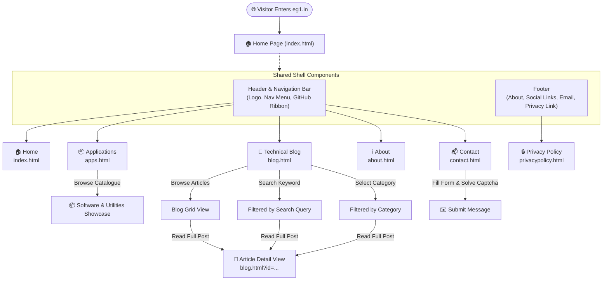

# EG1 - Web Application

Welcome to **EG1** ([eg1.in](https://www.eg1.in)), a web platform offering open-source engineering tools, software applications, and technical tutorials.

---

## 🗺️ Website Navigation & Flow Diagram



---

## 📐 Page Wireframes & Layout Structures

### 1. Global Page Layout Shell
```
+-------------------------------------------------------------------------+
| [EG1.in Logo]                    [GitHub Ribbon]                        |
| [ HOME ]    [ APPS ]    [ BLOG ]    [ ABOUT ]    [ CONTACT ]   [= MENU] |
+-------------------------------------------------------------------------+
|                                                                         |
|                          MAIN PAGE CONTENT                              |
|                                                                         |
+-------------------------------------------------------------------------+
| [EG1.in Summary]         [Follow Us: GH / FB / IG / X]   [Contact Email]|
| (C) 2026 EG1. All rights reserved.                 Privacy Policy       |
+-------------------------------------------------------------------------+
```

---

### 2. Home Page (`index.html`)
```
+-------------------------------------------------------------------------+
| HEADER & NAVIGATION                                                     |
+-------------------------------------------------------------------------+
| [==================== Hero / Image Slider Banner =====================] |
| "WELCOME TO EG1 - Solutions, Coding, Innovations & Creative Tools"      |
+-------------------------------------------------------------------------+
| FEATURED SOFTWARE & TOOLS                                               |
| +--------------------+  +--------------------+  +--------------------+  |
| | [Software Icon]    |  | [Software Icon]    |  | [Software Icon]    |  |
| | Software Title     |  | Software Title     |  | Software Title     |  |
| | Feature summary    |  | Feature summary    |  | Feature summary    |  |
| +--------------------+  +--------------------+  +--------------------+  |
+-------------------------------------------------------------------------+
| FOOTER                                                                  |
+-------------------------------------------------------------------------+
```

---

### 3. Applications Page (`apps.html`)
```
+-------------------------------------------------------------------------+
| HEADER & NAVIGATION                                                     |
+-------------------------------------------------------------------------+
| Page Banner: "APPLICATIONS"                                             |
+-------------------------------------------------------------------------+
| SOFTWARE CATALOG                                                        |
| +---------------------------------------------------------------------+ |
| | [App Icon]  Application Name                                        | |
| |             Description, features, supported OS & tools overview.   | |
| +---------------------------------------------------------------------+ |
| | [App Icon]  Application Name                                        | |
| |             Description, features, supported OS & tools overview.   | |
| +---------------------------------------------------------------------+ |
+-------------------------------------------------------------------------+
| FOOTER                                                                  |
+-------------------------------------------------------------------------+
```

---

### 4. Technical Blog Page (`blog.html`)
```
+-------------------------------------------------------------------------+
| HEADER & NAVIGATION                                                     |
+-------------------------------------------------------------------------+
| Page Banner: "BLOG"                                                     |
+------------------------------------------+------------------------------+
| MAIN CONTENT AREA                        | SIDEBAR                      |
|                                          | [ Search Blog...      ] [Go] |
| [Detail Mode]                            |                              |
| - Article Title & Publication Metadata   | CATEGORIES                   |
| - Rich Body with Syntax Highlighting     | - Programming                |
| - Embedded Media & Code Samples          | - Security                   |
|                                          | - Mathematics & Logic        |
| [Grid Mode]                              |                              |
| - Article Cards (Thumbnail, Excerpt)     | RECENT POSTS                 |
| - Pagination Controls                    | - Post Link #1               |
|                                          | - Post Link #2               |
+------------------------------------------+------------------------------+
| FOOTER                                                                  |
+-------------------------------------------------------------------------+
```

---

### 5. Contact Page (`contact.html`)
```
+-------------------------------------------------------------------------+
| HEADER & NAVIGATION                                                     |
+-------------------------------------------------------------------------+
| Page Banner: "CONTACT"                                                  |
+------------------------------------------+------------------------------+
| CONTACT FORM                             | DIRECT CHANNELS              |
| [ Your Name                          ]   | Email: eg1dotin@gmail.com    |
| [ Email Address                      ]   |                              |
| [ Contact Number                     ]   | Social Handles:              |
| [ Anti-Spam Math: 4 + 7 = [    ]     ]   | - GitHub: @EG1DOTIN          |
| [ Message Box                        ]   | - Facebook: @eg1dotin        |
| [ Submit Message ⮠                   ]   | - Instagram: @eg1dotin       |
|                                          | - X / Twitter: @eg1dotin     |
+------------------------------------------+------------------------------+
| FOOTER                                                                  |
+-------------------------------------------------------------------------+
```

---

## 📄 Website Pages Directory

| Page | File | Description & Key Features |
| :--- | :--- | :--- |
| **Home** | [`index.html`](file:///e:/EG1DOTIN/eg1/index.html) | Main landing page featuring an image slideshow banner, announcements, and quick access to featured software. |
| **Applications** | [`apps.html`](file:///e:/EG1DOTIN/eg1/apps.html) | Showcase of engineering utilities, security tools, and open-source applications. |
| **Blog** | [`blog.html`](file:///e:/EG1DOTIN/eg1/blog.html) | Multi-mode engineering blog with keyword search, category filtering, code syntax highlighting, and article reader. |
| **Contact** | [`contact.html`](file:///e:/EG1DOTIN/eg1/contact.html) | Visitor communication portal featuring an interactive contact form with math-based anti-spam verification. |
| **About** | [`about.html`](file:///e:/EG1DOTIN/eg1/about.html) | Overview of the EG1 platform, vision, mission, and open-source research background. |
| **Privacy Policy** | [`privacypolicy.html`](file:///e:/EG1DOTIN/eg1/privacypolicy.html) | Comprehensive privacy terms, cookies information, data protection guidelines, and user rights. |

---

## 🧩 Global Reusable Components

- **Header (`components/header.html`)**:
  - EG1 stylized branding logo
  - Top navigation bar with active page indicator
  - Responsive mobile drawer menu toggle
  - Top-right GitHub fork / repository banner

- **Footer (`components/footer.html`)**:
  - About summary snippet with quick link
  - Social network links (GitHub, Facebook, Instagram, X/Twitter)
  - Direct email contact launcher (`mailto:eg1dotin@gmail.com`)
  - Copyright statement and Privacy Policy link