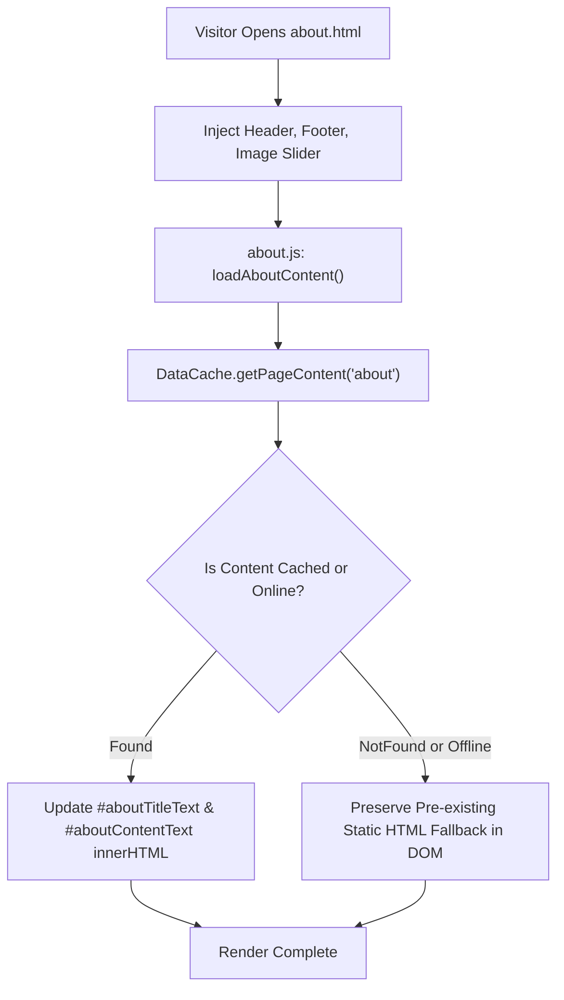

# Page Details: About EG1 (about.html)

Technical code architecture, execution logic, algorithm specifications, Mermaid flowcharts, code links, and dynamic fallback methods for the EG1 About Page.

---

## 🔗 Associated Code Files

- **HTML Template**: [about.html](../../about.html)
- **Controller Logic**: [js/about.js](../../js/about.js)
- **Data Engine**: [js/app.js](../../js/app.js)
- **Shell Components**: 
  - Header: [components/header.html](../../components/header.html)
  - Footer: [components/footer.html](../../components/footer.html)
- **Stylesheets**: [css/main.css](../../css/main.css), [css/common.css](../../css/common.css)

---

## 🎨 UI Wireframe & Layout

```
+-------------------------------------------------------------------------+
| HEADER & NAVIGATION                                                     |
+-------------------------------------------------------------------------+
| Header Banner: "ABOUT EG1"                                              |
+-------------------------------------------------------------------------+
| ABOUT CONTENT BOX (#aboutTitleText & #aboutContentText)                 |
| - Overview of the EG1 open-source platform                              |
| - Platform vision, mission, and technical research                      |
| - Developer profile, tools highlights, and community links              |
| - Fallback static HTML copy displayed if offline                        |
+-------------------------------------------------------------------------+
| FOOTER                                                                  |
+-------------------------------------------------------------------------+
```

---

## ⚡ Mermaid System & Dynamic Content Flowchart



---

## 💻 Code-Side Implementation & Algorithm Details

### Asynchronous Dynamic Content Resolution with Static Fallback
In [js/about.js](../../js/about.js), content is fetched asynchronously from Firestore via `DataCache`. If network connectivity is unavailable, the function exits cleanly without throwing errors, preserving static HTML fallback copy present in [about.html](../../about.html):

```javascript
// Key Method: loadAboutContent() in js/about.js
async function loadAboutContent() {
    var titleEl = document.getElementById("aboutTitleText");
    var contentEl = document.getElementById("aboutContentText");

    try {
        var data = await DataCache.getPageContent("about");
        if (data && data.title && titleEl) {
            titleEl.innerHTML = data.title;
        }
        if (data && data.content && contentEl) {
            contentEl.innerHTML = data.content;
        }
    } catch (e) {
        console.error("Error loading About page content:", e.message);
        // Pre-existing static HTML remains visible in DOM
    }
}
```

---

## 🗄️ Firestore Collection Mappings

- **Collection `website_content/pages`**: Document `pages` -> `about.title`, `about.content`.
