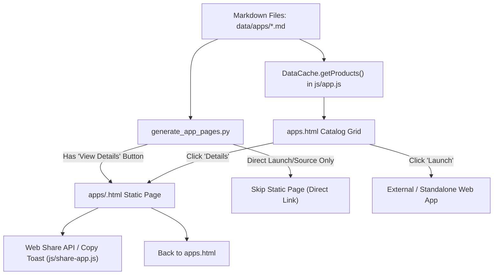

# Page Details: Applications Showcase & Static Detail Pages

Technical code architecture, execution logic, algorithm specifications, Mermaid flowcharts, code links, and clipboard fallback algorithms for the EG1 Applications Showcase (`apps.html`) and static application detail pages (`apps/<slug>.html`).

---

## 🔗 Associated Code Files

- **Catalog Template**: [apps.html](../../apps.html)
- **Catalog Controller**: [js/apps.js](../../js/apps.js)
- **Data Engine & Renderer**: [js/app.js](../../js/app.js)
- **Static Page Generator**: [automation-scripts/generators/generate_app_pages.py](../../automation-scripts/generators/generate_app_pages.py)
- **Consolidated Automation Runner**: [automation-scripts/run_all_checks.py](../../automation-scripts/run_all_checks.py)
- **Interactive Share Logic**: [js/share-app.js](../../js/share-app.js)
- **Stylesheets**: [css/theme.css](../../css/theme.css), [css/common.css](../../css/common.css), [css/main.css](../../css/main.css)

---

## 🎨 UI Architecture & Layout

```
+-------------------------------------------------------------------------+
| HEADER & NAVIGATION (Loaded via include-components.js)                  |
+-------------------------------------------------------------------------+
| Page Banner: "APPLICATIONS"                                             |
+-------------------------------------------------------------------------+
| MODE 1: CATALOGUE LIST VIEW (apps.html)                                 |
| +---------------------------------------------------------------------+ |
| | [App Icon]  Application Title                      Version 1.0.0    | |
| |             Short description (15.5px, normal style, line-height 1.6)| |
| |             [ VIEW DETAILS / LAUNCH ]   [ DOWNLOAD / SOURCE ]       | |
| +---------------------------------------------------------------------+ |
|                                                                         |
| MODE 2: STANDALONE STATIC DETAIL PAGES (apps/<app-slug>.html)           |
| +---------------------------------------------------------------------+ |
| | [Themed App Icon]  Application Title               Version 1.0.0    | |
| |                    Rendered Markdown Specification & Overview       | |
| |                    Features, GFM Tables, System Requirements        | |
| |                    [ DOWNLOAD / SOURCE ]                            | |
| | ------------------------------------------------------------------- | |
| | [ ← Back to all apps ]                           [ ↗ Share App ]    | |
| +---------------------------------------------------------------------+ |
+-------------------------------------------------------------------------+
| FOOTER (Loaded via include-components.js)                               |
+-------------------------------------------------------------------------+
```

---

## ⚡ Mermaid Application Architecture Flowchart



---

## 💻 Code-Side Implementation & Algorithm Details

### 1. Static Page Generation Filter (`generate_app_pages.py`)
To prevent orphaned or unnecessary detail pages, [`generate_app_pages.py`](../../automation-scripts/generators/generate_app_pages.py) only generates an HTML page in `apps/<slug>.html` when an application features a dedicated details action:
- Scans `button1` and `button2` for `DETAILS`, `VIEW DETAILS`, or `VIEW APP`.
- Direct web applications (such as **Marwadi Chess**) that feature direct `LAUNCH` and `SOURCE` buttons without an intermediate details page are intentionally omitted from `apps/`, keeping the directory clean and efficient.

### 2. Themed Web Share API & Toast Fallback (`js/share-app.js`)
Application detail pages include a native Share button:
- **Mobile & Supported Browsers**: Invokes `navigator.share({ title, text, url })` for seamless native sharing to WhatsApp, Messages, Twitter, etc.
- **Desktop / Fallback**: Copies canonical URL to clipboard via `navigator.clipboard.writeText()` and animates a floating `.share-toast` alert with theme-aware colors.

### 3. Dynamic Version Tracking (`DataCache.resolveProductVersion`)
Versions are resolved dynamically without hardcoding:
1. **GitHub Releases API (`fetch-github: "true"`)**: Real-time version check with persistent `localStorage` caching.
2. **Static Version String (`fetch-github: "false"`)**: Reads `version-string` directly from YAML frontmatter.
3. **Default Fallback**: Automatically defaults to `"1.0.0"`.

### 4. Consolidated Quality Assurance (`run_all_checks.py`)
All audits, page generators, and code compliance checks are executed in a single command via [automation-scripts/run_all_checks.py](../../automation-scripts/run_all_checks.py), completing in ~1.2 seconds.

### 5. Unified Button Theming & Icon Normalization
All action buttons (`DOWNLOAD`, `SOURCE`, `LAUNCH`) and footer navigation buttons (`Back to all apps`, `Share`) in `apps/<slug>.html` are unified under dynamic CSS Custom Property tokens (`var(--btn-primary-bg)`, `var(--btn-primary-text)`, `var(--btn-primary-border)`):
- **Dark Gray Theme**: Adapts to radiant Sky Blue (`#38bdf8`) with dark navy (`#0f172a`) contrast text and smooth elevation hover transitions.
- **Light Gray Theme**: Adapts to Dark Charcoal (`#2d3748`) with crisp white (`#ffffff`) text.
- **Icon Normalization**: Automatically normalizes icon definitions from `data/apps/*.md` frontmatter (e.g. `icon: icon-cloud-download` &rarr; `icon icon-cloud-download`, or label fallbacks), ensuring 100% visual parity between cards on `apps.html` and detail pages in `apps/<slug>.html`.

### 6. Header Cache Refresh & Reload Button
A dedicated cache-busting button is positioned in the header toolbar between the Notification Bell and the Theme Toggle:
- **Flushes Client Storage**: Wipes `localStorage` Markdown caches (`eg1_apps_md_cache_v2`, `eg1_direct_md_cache_v5`, etc.) while safely preserving the user's active theme preference (`eg1_theme`).
- **Cleans Session & Service Worker**: Clears `sessionStorage` and `caches` (CacheStorage API).
- **Hard Reload with Auto-Clean**: Forces a network fetch with `?refresh=<timestamp>`, immediately cleaning the address bar via `window.history.replaceState`.
- **Responsive Sizing**: Displays as a sleek 40×40px circular icon button matching the Notification Bell on desktop and mobile.

---

## 🗄️ YAML Frontmatter Schema ([data/apps/*.md](../../data/apps/))

```yaml
---
id: "test1-app"
name: "Test 1 App"
slug: "test1-app"
category: "Utilities"
product_type: "Desktop App"
version:
  version-string: "1.0.0"
  fetch-github: "true"
active: "1"
icon: ""
short_description: "A fast, lightweight test desktop application."
button1:
  DETAILS: "apps/test1-app.html"
  sameTab: "true"
button2:
  DOWNLOAD: "https://github.com/EG1DOTIN/EGClamNetAntivirus/releases"
  sameTab: "false"
  icon: "icon-cloud-download"
---
```
