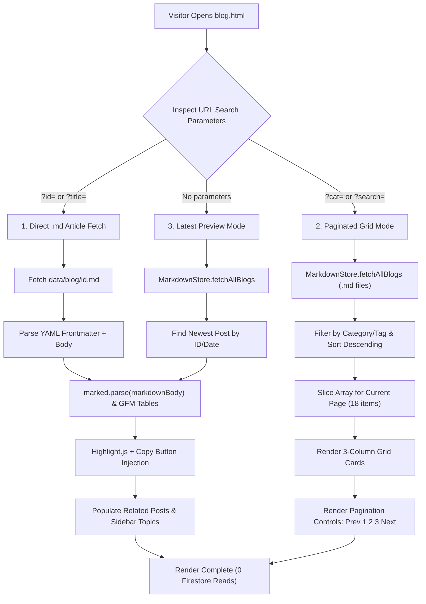

# Page Details: Technical Blog Engine (blog.html)

Technical code architecture, execution logic, algorithm specifications, Mermaid flowcharts, code links, and syntax highlighting algorithms for the EG1 Technical Blog Engine.

---

## 🔗 Associated Code Files

- **HTML Template**: [blog.html](../../blog.html)
- **Controller Logic**: [js/blog-page.js](../../js/blog-page.js)
- **Markdown Articles**: [data/blog/](../../data/blog)
- **Cache & Filter Store**: [js/app.js](../../js/app.js)
- **Stylesheets**: [css/blog-grid.css](../../css/blog-grid.css), [css/blog-detail.css](../../css/blog-detail.css)

---

## 🎨 UI Wireframe & Layout

```
+-------------------------------------------------------------------------+
| HEADER & NAVIGATION                                                     |
+-------------------------------------------------------------------------+
| Page Banner: "BLOG"                                                     |
+------------------------------------------+------------------------------+
| MAIN CONTENT AREA (col-md-8)             | SIDEBAR (col-md-4)           |
|                                          | [ Search blog...    ] [Go]   |
| [Detail / Latest Mode]                   |                              |
| - Hero Banner Image                      | CATEGORIES                   |
| - Title & Metadata (Category, Date)      | - Programming                |
| - Body Text & Formatted Paragraphs       | - Security & Logic           |
| - GFM Tables & Structured Lists          | - Web Utilities              |
| - Copyable Code Blocks (Highlight.js)    |                              |
| - Article Tags, Topic Chips & Share Action Bar   | PREVIOUS TOPICS              |
|                                          | - Topic Post Link #1         |
| [Grid Mode: ?cat= or ?search=]           | - Topic Post Link #2         |
| - 3-Column Card Grid (18 items/page)     | - Topic Post Link #3         |
| - Pagination: [Prev] 1 2 3 [Next]        |                              |
+------------------------------------------+------------------------------+
| FOOTER                                                                  |
+-------------------------------------------------------------------------+
```

---

## ⚡ Mermaid Multi-Mode Direct Markdown Execution Architecture



---

## 💻 Code-Side Implementation & Algorithm Details

### 1. 1-File Markdown Authoring Workflow
To publish a new blog post, simply create a Markdown file in `data/blog/id<id>.md`:

```markdown
---
id: "71"
title: "Mastering Modern CSS Grid"
heading: "Mastering Modern CSS Grid"
category: "web"
tags: ["css", "web development"]
author: "EG1"
createdAt: "2026-08-30"
release_date: "2026-08-30"
output_image: "img/blog/id71.webp"
short_description: "Learn how to build responsive layouts using CSS Grid and clamp."
active: "1"
---

# Mastering Modern CSS Grid

Here is our tutorial body in standard Markdown...
```

### 2. Client-Side YAML Frontmatter & Markdown Parser
In [js/blog-page.js](../../js/blog-page.js), frontmatter is parsed directly on the client with zero build step:
- Parses metadata delimited by `---`.
- Parses tags, release dates, images, and descriptions.
- Renders body text and GFM tables cleanly using `marked.parse()`.

### 3. Syntax Highlighting & Code Copy Injection
In [js/blog-page.js](../../js/blog-page.js), code blocks are formatted using `Highlight.js` with floating copy buttons:

```javascript
function initializeCodeBlocks() {
    document.querySelectorAll('.ai-blog-content pre').forEach(function (pre) {
        var code = pre.querySelector('code') || pre;
        if (typeof hljs !== 'undefined' && typeof hljs.highlightElement === 'function') {
            hljs.highlightElement(code);
        }
        
        var copyBtn = document.createElement("button");
        copyBtn.className = "copy-code-btn";
        copyBtn.innerText = "Copy";
        copyBtn.onclick = function() {
            navigator.clipboard.writeText(code.textContent);
            copyBtn.innerText = "Copied!";
            setTimeout(() => copyBtn.innerText = "Copy", 2000);
        };
        pre.appendChild(copyBtn);
    });
}
```

### 4. Static SEO-Friendly Blog Architecture (`blog/<slug>.html`)
To maximize organic search discoverability and instant social previews, the platform generates individual static HTML files using [`automation-scripts/generators/generate_blog_pages.py`](../../automation-scripts/generators/generate_blog_pages.py):
- **Programming-Aware Slugification**: Maps programming terms cleanly into URL slugs to avoid broken or truncated URLs:
  - `C++` &rarr; `cpp` (e.g. `namespace-in-C++` &rarr; [`blog/namespace-in-cpp.html`](../../blog))
  - `C#` &rarr; `csharp`
  - `F#` &rarr; `fsharp`
  - `.NET` &rarr; `dotnet`
  - `&` &rarr; `and`
- **Pre-Rendered Social & SEO Metadata**: Each page includes hardcoded, crawler-friendly tags:
  - `<meta property="og:image" content="https://www.eg1.in/img/blog/id<id>.webp" />`
  - `<meta name="twitter:card" content="summary_large_image" />`
  - JSON-LD structured data schema (`BlogPosting`).
- **Mapping Dataset**: Outputs bidirectional slug-to-ID mappings in [`automation-scripts/data/blog_slugs.json`](../../automation-scripts/data/blog_slugs.json).

### 5. Unified Minimalist Share Button
Replaced bloated multi-icon social button bars with a single, space-optimized **Share** button across all entry points:
- **Universal Coverage**: Active on static pre-rendered articles ([`blog/*.html`](../../blog)), direct ID parameters (`blog.html?id=<id>`), and the default blog landing view ([`blog.html`](../../blog.html)).
- **Canonical Static URL Resolution**: When sharing from `blog.html`, `js/blog-page.js` dynamically resolves the newest tutorial's canonical URL (`https://www.eg1.in/blog/<latest-slug>.html`), guaranteeing that social media crawlers on WhatsApp, LinkedIn, X, and Facebook generate rich image previews and exact article headings.
- **Native Web Share API**: Uses `navigator.share()` on mobile devices, tablets, and modern desktop browsers to trigger native platform sharing with title, text, and canonical link.
- **Polished Clipboard Fallback**: For browsers without Web Share support, falls back to `navigator.clipboard.writeText()` with a floating green toast alert (`.share-copy-toast`) and interactive button label state transition (`"Copied!"` for 2.5 seconds).

### 6. Fluid Responsive Typography & Whitespace Polish
- **Scalable Body Typography**: Uses CSS `clamp()` tokens (`clamp(1.12rem, 1.04rem + 0.45vw, 1.25rem)`) for effortless readability across mobile and desktop displays.
- **Monospace Code Preservation**: Keeps `<pre><code>` blocks locked at standard compact sizes (`clamp(13.5px, 0.85vw + 11px, 15px)`) to preserve syntax formatting and avoid horizontal code stretching.
- **Vertical Whitespace Optimization**: Refined paragraph margins from `1.35em` down to `0.85em` and streamlined bottom action bar padding to eliminate excessive vertical gaps.

---

## 🗄️ Storage & Client-Side Architecture

- **Storage Location**: [data/blog/](../../data/blog) (`id<id>.md` individual Markdown files).
- **Static HTML Pages**: [blog/](../../blog) (`<slug>.html` pre-rendered static articles).
- **Frontmatter Fields**: `id`, `title`, `heading`, `category`, `tags`, `author`, `createdAt`, `release_date`, `output_image`, `short_description`, `active`.
- **Database Dependency**: **Zero Firestore DB reads** (eliminates quota consumption, network latency, and billing limits).
- **Client Cache**: `localStorage` (`eg1_direct_md_cache_v5`) for instant subsequent renders.
