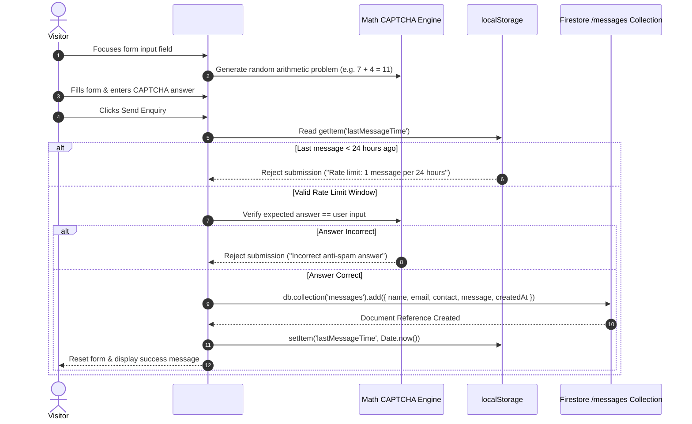

# Page Details: Contact Portal (contact.html)

Technical code architecture, execution logic, algorithm specifications, Mermaid flowcharts, code links, anti-spam engines, and rate limiting algorithms for the EG1 Contact Inquiry Portal.

---

## 🔗 Associated Code Files

- **HTML Template**: [contact.html](../../contact.html)
- **Controller Logic**: [js/contact.js](../../js/contact.js)
- **Cloud Security Rules**: Cloud Firestore Security Rules (enforcing schema whitelisting & timestamp constraints)
- **Stylesheets**: [css/main.css](../../css/main.css), [css/common.css](../../css/common.css)

---

## 🎨 UI Wireframe & Layout

```
+-------------------------------------------------------------------------+
| HEADER & NAVIGATION                                                     |
+-------------------------------------------------------------------------+
| CONTACT PORTAL                                                          |
+------------------------------------------+------------------------------+
| INQUIRY FORM (col-md-6)                  | DIRECT CHANNELS (col-md-6)   |
| "Any message?"                           | Email: eg1dotin@gmail.com    |
| [ Your Name                          ]   |                              |
| [ Email Address                      ]   | Social Platforms:            |
| [ Phone Number                       ]   | - GitHub: @EG1DOTIN          |
| [ Anti-Spam Check: 5 + 3 = [    ]    ]   | - Facebook: @eg1dotin        |
| [ Message Textarea                   ]   | - Instagram: @eg1dotin       |
| [ Send Enquiry ⮠                      ]   | - X / Twitter: @eg1dotin     |
+------------------------------------------+------------------------------+
| FOOTER                                                                  |
+-------------------------------------------------------------------------+
```

---

## ⚡ Mermaid Anti-Spam & Submission Sequence



---

## 💻 Code-Side Implementation & Algorithm Details

### 1. Dynamic Arithmetic CAPTCHA Algorithm
In [js/contact.js](../../js/contact.js), a randomized math problem is generated upon user interaction to prevent bot submissions:

```javascript
// Key Method: generateCaptcha() in js/contact.js
function generateCaptcha() {
    var operators = ['+', '-', '*'];
    var op = operators[Math.floor(Math.random() * operators.length)];
    var num1 = Math.floor(Math.random() * 10) + 1;
    var num2 = Math.floor(Math.random() * 10) + 1;
    
    var expected = (op === '+') ? num1 + num2 : (op === '-') ? num1 - num2 : num1 * num2;
    window.captchaAnswer = expected;
    $('#captchaQuestion').text(num1 + ' ' + op + ' ' + num2 + ' = ');
}
```

### 2. Sliding Window Client-Side Rate Limiting
To prevent spamming the Firestore `/messages` collection, submission timestamps are recorded in `localStorage`:

```javascript
// Key Method: checkRateLimit() in js/contact.js
var lastSent = localStorage.getItem("lastMessageTime");
var WINDOW_MS = 24 * 60 * 60 * 1000; // 24 hours

if (lastSent && (Date.now() - lastSent < WINDOW_MS)) {
    alert("You can send a message once every 24 hours. Please try again later.");
    return false;
}
```

---

## 🗄️ Firestore Mappings & Security Rules

- **Collection `messages`**: Document schema: `name`, `email`, `contact`, `message`, `createdAt`.
- **Server Validation**: Cloud Firestore Security Rules enforce field whitelist, message string length <= 2000, and server timestamp.
