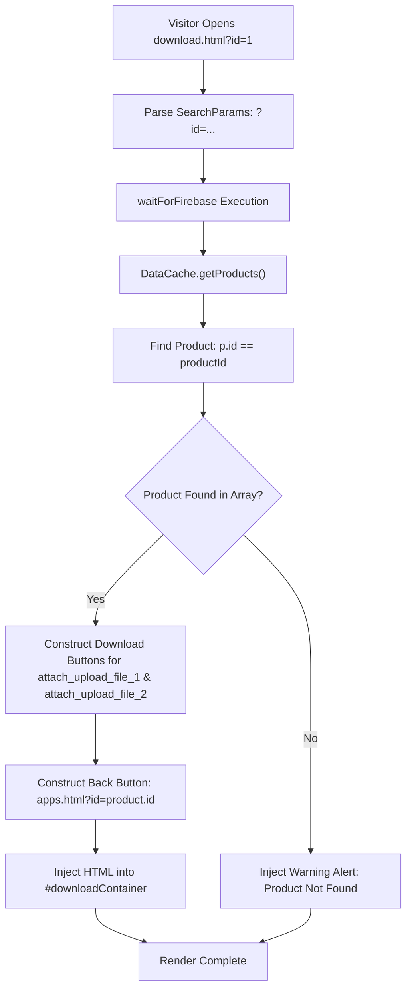

# Page Details: Downloads Portal (download.html)

Technical code architecture, execution logic, algorithm specifications, Mermaid flowcharts, code links, and product download link resolution for the EG1 Download Page.

---

## 🔗 Associated Code Files

- **Application Catalog**: [apps.html](../../apps.html)
- **Controller Logic (Archived)**: ../../unused-old-files/js/download.js *(archived)*
- **Data Engine**: [js/app.js](../../js/app.js)

---

## 🎨 UI Wireframe & Layout

```
+-------------------------------------------------------------------------+
| HEADER & NAVIGATION                                                     |
+-------------------------------------------------------------------------+
| DOWNLOAD PORTAL                                                         |
| Application Title - Downloads                                           |
| Version: 1.0  |  Total Downloads: 1,420                                 |
| <hr />                                                                  |
| Download Options:                                                       |
| [ 📥 Download File 1 (Primary) ]    [ 📥 Download File 2 (Mirror) ]    |
|                                                                         |
| [ ← Back to Product Details ]  (Routes to apps.html?id=...)             |
+-------------------------------------------------------------------------+
| FOOTER                                                                  |
+-------------------------------------------------------------------------+
```

---

## ⚡ Mermaid Resolution & Navigation Flowchart



---

## 💻 Code-Side Implementation & Algorithm Details

### Dynamic Download Resolver & Routing Link Fix
In ../../unused-old-files/js/download.js *(archived)*, the selected product parameters were resolved from `DataCache.getProducts()`. The back button was dynamically constructed to route back to `apps.html?id=...`:

```javascript
// Key Method: Product Resolver in js/download.js
$(document).ready(async function () {
    waitForFirebase(async function () {
        var products = await DataCache.getProducts();
        var urlParams = new URLSearchParams(window.location.search);
        var productId = urlParams.get('id') || '1';
        var product = products.find(p => p.id == productId);

        if (product) {
            var file1 = product.attach_upload_file_1 || '#';
            var file2 = product.attach_upload_file_2 || '';
            var downloadHtml = '<h3>' + product.product_name + ' - Downloads</h3>' +
                '<p>Version: ' + (product.version || '1.0') + '</p>' +
                '<a href="' + file1 + '" class="btn btn-success">Download File 1</a>' +
                (file2 ? '<a href="' + file2 + '" class="btn btn-info">Download File 2</a>' : '') +
                '<p style="margin-top:20px;"><a href="apps.html?id=' + product.id + '" class="btn btn-primary">Back to Product Details</a></p>';
            $('#downloadContainer').html(downloadHtml);
        }
    });
});
```

---

## 🗄️ Firestore Collection Mappings

- **Collection `products`**: `id`, `product_name`, `version`, `downloaded`, `attach_upload_file_1`, `attach_upload_file_2`.
