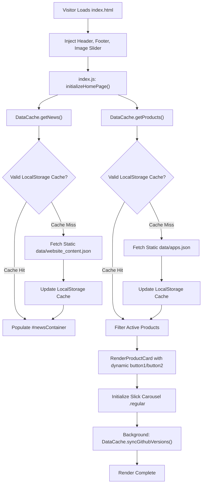

# Page Details: Home Page (index.html)

Technical code architecture, execution logic, algorithm specifications, Mermaid flowcharts, code links, and Firestore collection mappings for the EG1 Home Landing Page.

---

## 🔗 Associated Code Files

- **HTML Template**: [index.html](../../index.html)
- **Controller Logic**: [js/index.js](../../js/index.js)
- **Data Engine**: [js/app.js](../../js/app.js)
- **Shell Components**: 
  - Header: [components/header.html](../../components/header.html)
  - Footer: [components/footer.html](../../components/footer.html)
  - Slider: [components/image_slider.html](../../components/image_slider.html)
- **Stylesheets**: [css/main.css](../../css/main.css), [css/common.css](../../css/common.css), [css/responsive.css](../../css/responsive.css)

---

## 🎨 UI Wireframe & Layout

```
+-------------------------------------------------------------------------+
| [EG1 Logo]        [Home] [Apps] [Blog] [About] [Contact]  [GitHub Ribbon]|
+-------------------------------------------------------------------------+
| [=================== Image Slider Header Banner =====================]  |
| "WELCOME TO EG1 - Solutions, Coding, Innovations & Creative Tools"      |
+-------------------------------------------------------------------------+
| ANNOUNCEMENTS / NEWS CONTAINER (#newsContainer)                         |
| "A platform for solutions, coding, programming, innovations..."        |
+-------------------------------------------------------------------------+
| FEATURED APPLICATIONS (Slick Carousel Slider .regular)                  |
| +-------------------+  +-------------------+  +-------------------+     |
| | [App Icon]        |  | [App Icon]        |  | [App Icon]        |     |
| | Product Title     |  | Product Title     |  | Product Title     |     |
| | Version 1.0       |  | Version 1.0       |  | Version 1.0       |     |
| | Short Description |  | Short Description |  | Short Description |     |
| | [View] [Download] |  | [View] [Download] |  | [View] [Download] |     |
| +-------------------+  +-------------------+  +-------------------+     |
+-------------------------------------------------------------------------+
| FOOTER (Logo Badge, About Snippet, Follow Links, Contact CTA, Copyright)|
+-------------------------------------------------------------------------+
```

---

## ⚡ Mermaid System & Data Flowchart



---

## 💻 Code-Side Implementation & Algorithm Details

### 1. Zero-Read Static JSON Caching Algorithm (`DataCache`)
The home page utilizes the `DataCache` pattern defined in [js/app.js](../../js/app.js). Product catalog entries and announcement copy are served from static JSON files (`data/apps.json`, `data/website_content.json`) with an in-browser `localStorage` cache:

```javascript
// Key Method: DataCache.getProducts() in js/app.js
getProducts: async function () {
    var cached = this._getPersistentCache("eg1_products_cache");
    if (cached) return cached;

    // Load from local static JSON dataset (0 Firestore reads)
    var response = await fetch("data/apps.json");
    var data = await response.json();
    this._setPersistentCache("eg1_products_cache", data);
    return data;
}
```

### 2. Dynamic Dual Buttons & Background GitHub Version Sync
In [js/app.js](../../js/app.js), `RenderHelpers.renderProductCard` dynamically parses `button1` and `button2` objects, and stamps elements with `data-product-version-id` for live background GitHub version resolution via `DataCache.syncGithubVersions()`.

### 3. Dynamic Slick Carousel Initialization
In [js/index.js](../../js/index.js), once cards are appended to `.regular`, the Slick carousel library is instantiated with responsive breakpoint rules:

```javascript
// Key Method: initializeHomePage() in js/index.js
$('.regular').slick({
    dots: true,
    infinite: true,
    slidesToShow: 3,
    slidesToScroll: 1,
    autoplay: true,
    autoplaySpeed: 3000,
    responsive: [
        { breakpoint: 992, settings: { slidesToShow: 2 } },
        { breakpoint: 600, settings: { slidesToShow: 1 } }
    ]
});
```

---

## 🗄️ Dataset & Schema Mappings

- **File [data/website_content.json](../../data/website_content.json)**: Static announcement copy and section metadata (`pages.homepage`).
- **Directory [data/apps/](../../data/apps/)**: Collection of Markdown application files rendered inside the carousel slider.

