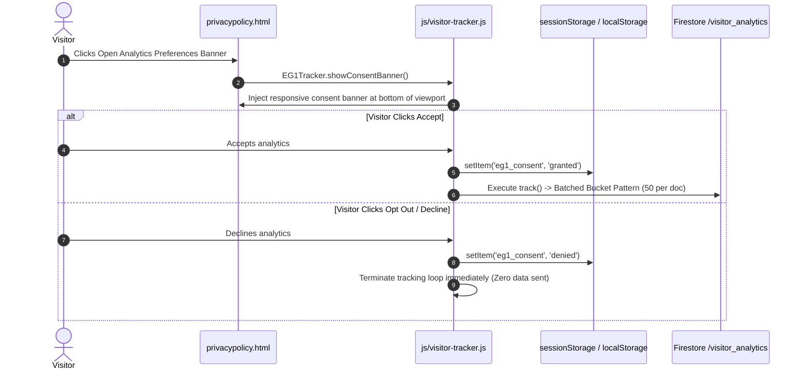

# Page Details: Privacy Policy & Telemetry Controls (privacypolicy.html)

Technical code architecture, execution logic, algorithm specifications, Mermaid flowcharts, code links, and visitor telemetry consent controls for the EG1 Privacy Policy Page.

---

## 🔗 Associated Code Files

- **HTML Template**: [privacypolicy.html](../../privacypolicy.html)
- **Telemetry Module**: [js/visitor-tracker.js](../../js/visitor-tracker.js)
- **Stylesheets**: [css/main.css](../../css/main.css), [css/common.css](../../css/common.css)

---

## 🎨 UI Wireframe & Layout

```
+-------------------------------------------------------------------------+
| HEADER & NAVIGATION                                                     |
+-------------------------------------------------------------------------+
| PRIVACY POLICY                                                          |
| Last updated: 2026                                                      |
| <hr />                                                                  |
| 1. Information Collection and Use                                       |
|    - Detailed breakdown of collected telemetry (IP, Device, City)      |
|                                                                         |
| 2. No Sale of Data Guarantee                                            |
|    - Explicit pledge that visitor data is never monetized or shared.    |
|                                                                         |
| 3. Analytics Preferences & Consent Control                              |
|    - [ ⚙️ Open Analytics Preferences Banner ]                          |
|      (Calls EG1Tracker.showConsentBanner())                            |
+-------------------------------------------------------------------------+
| FOOTER                                                                  |
+-------------------------------------------------------------------------+
```

---

## ⚡ Mermaid Telemetry Consent & Bucket Logging Sequence



---

## 💻 Code-Side Implementation & Algorithm Details

### 1. Interactive Consent Banner Trigger
In [privacypolicy.html](../../privacypolicy.html), the consent preferences banner is triggered programmatically via `EG1Tracker`:

```javascript
// Key Trigger Hook in js/visitor-tracker.js
showConsentBanner: function () {
    if (document.getElementById('eg1-consent-banner')) return;
    var banner = document.createElement('div');
    banner.id = 'eg1-consent-banner';
    banner.innerHTML = '<div class="banner-content"><p>We respect your privacy...</p>' +
        '<button onclick="EG1Tracker.grantConsent()">Accept</button>' +
        '<button onclick="EG1Tracker.denyConsent()">Opt Out</button></div>';
    document.body.appendChild(banner);
}
```

### 2. Batched Bucket Telemetry Pattern (Write Optimization)
In [js/visitor-tracker.js](../../js/visitor-tracker.js), to minimize Firestore write costs, telemetry entries are stored in arrays inside capped bucket documents (50 entries per `page_N` document):

```javascript
// Key Method: recordTelemetryBucket(data) in js/visitor-tracker.js
async function recordTelemetryBucket(data) {
    const metaRef = db.collection('visitor_analytics').doc('meta');
    await db.runTransaction(async (transaction) => {
        const metaSnap = await transaction.get(metaRef);
        let currentBucket = metaSnap.exists ? (metaSnap.data().currentBucket || 1) : 1;
        let currentCount = metaSnap.exists ? (metaSnap.data().currentCount || 0) : 0;

        if (currentCount >= 50) {
            currentBucket++;
            currentCount = 0;
        }

        const bucketRef = db.collection('visitor_analytics').doc('page_' + currentBucket);
        transaction.set(bucketRef, {
            logs: firebase.firestore.FieldValue.arrayUnion({ ...data, timestamp: new Date().toISOString() })
        }, { merge: true });

        transaction.set(metaRef, { currentBucket, currentCount: currentCount + 1 });
    });
}
```

---

## 🗄️ Firestore Collection Mappings

- **Collection `visitor_analytics/page_X`**: `logs` array (50 entries max: `ipHash`, `path`, `device`, `geo`, `timestamp`).
- **Collection `visitor_analytics/meta`**: Document tracking `currentBucket` & `currentCount`.
