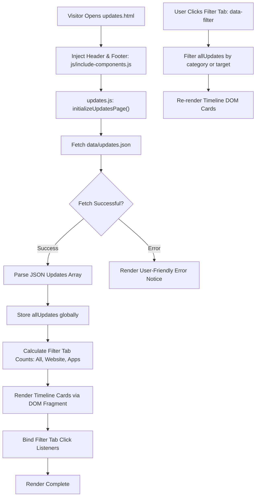

# Page Details: Updates & Release Log (updates.html)

Technical code architecture, JSON data schema, execution logic, algorithm specifications, Mermaid flowcharts, code links, and notification bell popover synchronization for the EG1 Updates & Release Log Page.

---

## 🔗 Associated Code Files

- **HTML Template**: [updates.html](../../updates.html)
- **Controller Logic**: [js/updates.js](../../js/updates.js)
- **Data Source**: [data/updates.json](../../data/updates.json)
- **Shell & Navigation Components**: 
  - Header: [components/header.html](../../components/header.html)
  - Footer: [components/footer.html](../../components/footer.html)
  - Navigation Component Script: [js/include-components.js](../../js/include-components.js)
- **Stylesheets**: [css/theme.css](../../css/theme.css), [css/common.css](../../css/common.css), [css/menuCss.css](../../css/menuCss.css), [css/responsive.css](../../css/responsive.css)

---

## 🎨 UI Wireframe & Layout

```
+-------------------------------------------------------------------------+
| [EG1 Logo]  [Home] [Apps] [Explore v] [About] [Contact]   (Bell)[Theme] |
|                             |-> Updates                                 |
|                             |-> Blog                                    |
+-------------------------------------------------------------------------+
| [=================== Image Slider Header Banner =====================]  |
| "UPDATES & RELEASES - Release changelogs & software updates"             |
+-------------------------------------------------------------------------+
| FILTER TABS:  [ All (2) ]  [ Website (1) ]  [ Apps (1) ]                |
+-------------------------------------------------------------------------+
| TIMELINE CARDS CONTAINER (#updatesTimelineContainer)                   |
|                                                                         |
| +---------------------------------------------------------------------+ |
| | [Globe Icon]  EG1 Website v3.0.0               [Aug 29, 2026] [v3.0]| |
| | Major platform evolution featuring dynamic theme engine...          | |
| | - Dynamic Light & Dark Gray theme switcher with zero-flicker        | |
| | - Interactive Notification Bell popover dropdown in navigation     | |
| | - Enhanced Explore navigation with click-to-toggle dropdown         | |
| | [Browse Updates ->]                                                 | |
| +---------------------------------------------------------------------+ |
|                                                                         |
| +---------------------------------------------------------------------+ |
| | [App Icon]    Marwadi Chess v3.7.1             [Aug 24, 2026] [v3.7]| |
| | Production release introducing comprehensive PGN replay...          | |
| | - Live PGN interactive game viewer with Move-by-Move controls       | |
| | - Real-time Stockfish engine evaluation and analysis                | |
| | [Launch App ->]                                                     | |
| +---------------------------------------------------------------------+ |
+-------------------------------------------------------------------------+
| FOOTER (Logo Badge, About Snippet, Follow Links, Contact CTA, Copyright)|
+-------------------------------------------------------------------------+
```

---

## ⚡ Mermaid System & Data Flowchart



---

## 🗄️ JSON Data Schema (`data/updates.json`)

The updates log is managed through a structured client-side JSON repository:

```json
{
  "updates": [
    {
      "id": "eg1-v3-release",
      "version": "3.0.0",
      "title": "EG1 Website v3.0.0 Released",
      "date": "Aug 29, 2026",
      "type": "website",
      "category": "major",
      "target": "website",
      "description": "Major platform evolution featuring dynamic Light/Dark theme switching, interactive Notification Bell, and modernized UI styling.",
      "highlights": [
        "Dynamic Light & Dark Gray theme switcher with instant zero-flicker pre-load",
        "Interactive Notification Bell popover dropdown in header navigation",
        "Enhanced Explore navigation with click-to-toggle submenu",
        "Slight Dark Gray button aesthetic and blended seamless navbar"
      ],
      "link": "updates.html",
      "linkText": "Browse Updates"
    },
    {
      "id": "marwadi-chess-v371",
      "version": "3.7.1",
      "title": "Marwadi Chess v3.7.1 Released",
      "date": "Aug 24, 2026",
      "type": "app",
      "category": "release",
      "target": "mchess",
      "description": "Production release introducing interactive PGN replays, live broadcast viewer, and engine analysis.",
      "highlights": [
        "Interactive PGN replay with Move-by-Move controls",
        "Real-time Stockfish engine evaluation",
        "Dark mode chessboard UI optimization"
      ],
      "link": "apps.html?id=marwadi-chess",
      "linkText": "Launch App"
    }
  ]
}
```

---

## 🔔 Header Notification Bell & Popover Integration

The notification bell icon (`#notificationBellBtn`) in [components/header.html](../../components/header.html) is managed dynamically by [js/include-components.js](../../js/include-components.js):

1. **Unread Badge Calculation**:
   - Reads `localStorage.getItem("eg1_seen_updates_v1")`.
   - Compares latest update IDs against seen IDs.
   - If unseen updates exist, displays the unread badge (`.notification-badge`) with count and adds the `.has-unread` shake animation.
2. **Popover Dropdown**:
   - Clicking the bell toggles the `#notificationBellPopover` dropdown panel.
   - Shows compact preview cards with direct links to [updates.html](../../updates.html).
   - "Mark all as read" button saves all current IDs to `localStorage` and dismisses the unread badge.

---

## 🔒 Security & Code Standards

- **Strict Separation of Concerns**: All timeline rendering, filtering, and icon generators reside in [js/updates.js](../../js/updates.js). No inline scripts or inline event handlers are embedded in [updates.html](../../updates.html).
- **XSS Prevention**: All strings from `updates.json` are sanitized via `escapeHtml()` and DOM text nodes before being rendered into the DOM.
- **Automated Validation**: Verified 100% compliant with [automation-scripts/audits/audit_code_standards.py](../../automation-scripts/audits/audit_code_standards.py) and [automation-scripts/audits/validate_theme_assets.py](../../automation-scripts/audits/validate_theme_assets.py).
